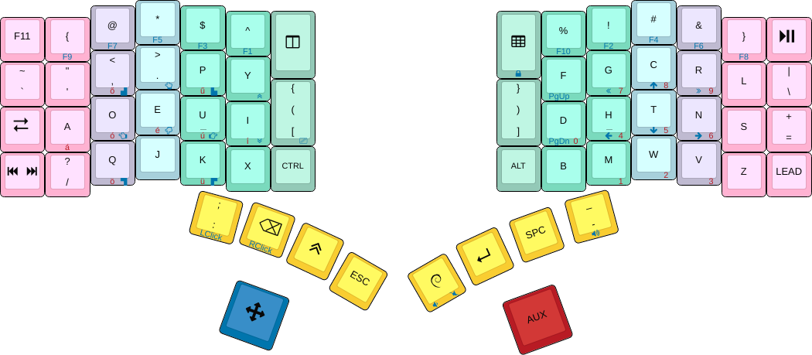
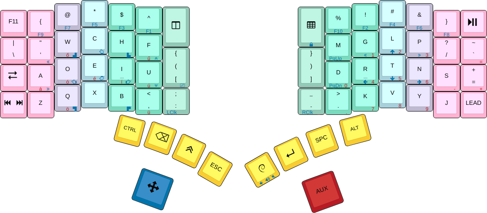

<!-- -*- mode: markdown; fill-column: 8192 -*- -->

algernon's Keyboardio Model01 firmware
======================================

This is my work in progress firmware Sketch for the [Keyboardio Model 01][kbdio], using [Kaleidoscope][ks] together with a fair amount of plugins.

This is a reasonably complete example of how to work with the firmware and surrounding libraries to extend it, to compose the various components, to have something useful in the end.

 [ks]: https://github.com/keyboardio/Kaleidoscope
 [kbdio]: https://shop.keyboard.io/

It is a heavy work in progress, with some awful hacks and workarounds here and there. Eventually these will be cleaned up.

It is based on my previous [ErgoDox EZ layout][ergodox-layout], a lot of things are common between the two.

 [ergodox-layout]: https://github.com/algernon/ergodox-layout

## Table of Contents

* [Layouts](#layouts)
    - [Base layer](#base-layer)
    - [ADORE layer](#adore-layer)
* [Special features](#special-features)
    - [Symbolic Unicode Input](#symbolic-unicode-input)
* [Installation](#installation)
* [Plugins used](#plugins-used)
* [License](#license)

# Layouts

## Base layer

This is a [Dvorak][dvorak]-inspired layout, with some changes here and there, to make it more suited for programming, and for a non-traditional keyboard.

 [dvorak]: https://en.wikipedia.org/wiki/Dvorak_Simplified_Keyboard

[(Layout editor)](http://www.keyboard-layout-editor.com/#/gists/f938a01e31f6b329364aea02cbda9977)

* Keys with blue front-prints are activated by tapping or holding the left palm key (also colored blue).
* Keys with red front-prints are activated by tapping or holding the right palm key (also colored red).
* The `Alt`, `Control`, `Shift` modifiers are all [one-shot][kaleidoscope:oneshot], and so are the two palm keys.
* The LED colors are governed by the [Colormap][kaleidoscope:colormap] plugin for the most part:
  - By default, the modifiers and palm keys are highlighted with different colors.
  - On different layers, the keys that have changed behaviour, are colored differently.
  - When a modifier is active, the [LED-ActiveModColor][kaleidoscope:led-activemodcolor] plugin turns it white.
  - Additional LED effects are provided by [LED-Stalker][kaleidoscope:led-stalker], [LED-Wavepool][kaleidoscope:led-wavepool], and [LEDEffect-DigitalRain][kaleidoscope:ledeffect-digitalrain]. All of these are conditional.
  - One can also switch LEDs off.
* The top row was inspired by [Programmer Dvorak][dvorak:prg], but the symbols are arranged so that the most used ones are easier to access. The numbers are available in a numpad-like layout on a separate layer.
* The `R0C6` and `R0C9` keys are to control `tmux` and `screen`, and are dependent on my tmux setup.
* The `R1C6` and `R1C9` keys are [tap-dance][kaleidoscope:tap-dance] keys. Tapped once, they input `[{`/`}]` (without and with `Shift`, respectively). Tapped twice, they input `(`/`)`. Tapped three times, they input Japanese brackets, `「`/`」`.
* The `LEAD` keys is a [leader key][kaleidoscope:leader], with the following sequences built-in:
  - `LEAD u` starts the [symbolic unicode input](#symbolic-unicode-input) method.
  - `LEAD s` does a lot of magic to type a shruggy: `¯ \_(ツ )_/¯`.
  - `LEAD LEAD` switches to the next LED mode.
  - `LEAD BUTTERFLY` (where `BUTTERFLY` is the `R2C9` key) does an `M-x butterfly RET y`, in honor of [xkcd#378](https://xkcd.com/378/).
  - `LEAD GUI` switches to a special `APPSEL` layer where a few (highlighted) keys on the right side can be used to select an application to switch to.
  - `LEAD Enter GUI` launches an application selector on the host side.
  - `LEAD r` inputs `Right Alt`, my `Compose` key of choice.
* The `R2C6` key is also a [tap-dance][kaleidoscope:tap-dance] key, which inputs `:` on a single tap, `;` otherwise.
* The `R0C0` key acts as `F11`, but triggers only on release. This is so that it can be held to go into programmable mode when re-flashing, without sending way too many `F11` held events.
* There are a few other actions one can trigger with [magic combos][kaleidoscope:magic-combos]:
  - `PALMS + AD`: Switch to the [ADORE](#adore-layer) layer.
  - `PALMS + R0C7 + R1C7 + R2C7`: Toggle the experimental Steno layer ond and off.
* We are also using [mouse keys][kaleidoscope:mouse-keys], and [macros][kaleidoscope:macros] for some of the features.
* The keyboard can also communicate with the host bidirectionally, thanks to the [Focus][kaleidoscope:focus] plugin. See [Chrysalis][chrysalis] for a simple client.

  [dvorak:prg]: http://www.kaufmann.no/roland/dvorak/
  [kaleidoscope:oneshot]: https://github.com/keyboardio/Kaleidoscope-OneShot
  [kaleidoscope:colormap]: https://github.com/keyboardio/Kaleidoscope-Colormap
  [kaleidoscope:led-activemodcolor]: https://github.com/keyboardio/Kaleidoscope-LED-ActiveModColor
  [kaleidoscope:led-stalker]: https://github.com/keyboardio/Kaleidoscope-LED-Stalker
  [kaleidoscope:tap-dance]: https://github.com/keyboardio/Kaleidoscope-TapDance
  [kaleidoscope:leader]: https://github.com/keyboardio/Kaleidoscope-Leader
  [kaleidoscope:magic-combos]: https://github.com/keyboardio/Kaleidoscope-MagicCombo
  [kaleidoscope:mouse-keys]: https://github.com/keyboardio/Kaleidoscope-MouseKeys
  [kaleidoscope:macros]: https://github.com/keyboardio/Kaleidoscope-Macros
  [kaleidoscope:focus]: https://github.com/keyboardio/Kaleidoscope-Focus
  [chrysalis]: https://github.com/algernon/Chrysalis

## ADORE layer

[(Layout editor)](http://www.keyboard-layout-editor.com/#/gists/da05641b419790a7a4c1297c4e58ec9f)

A heavy work in progress. The main difference is in the layout of alphanumerics, but most other things work as on the [base layer](#base-layer).

# Special features

## Symbolic Unicode Input

Once in the Symbolic Unicode Input mode (implemented by using the [Syster][kaleidoscope:syster] plugin), one is able to type in symbol names, press `Space`, and get the Unicode symbol itself back. When in the mode, `⌨` is printed first. Once the sequence is finished, all of it is erased by sending enough `Backspace` taps, and the firmware starts the OS-specific unicode input sequence. Then, it looks up the symbol name, and enters the associated code.

 [kaleidoscope:syster]: https://github.com/keyboardio/Kaleidoscope-Syster

For the list of supported symbols, please [see the source][src:SymUnI].

 [src:SymUnI]: https://github.com/algernon/Model01-sketch/blob/master/src/SymUnI.cpp#L30

This is an experimental feature, and may or may not work reliably.

# Installation

The repository and its build system is set up in a way that allows one to download Arduino only, and let the repository handle the rest. For an initial setup, simply type `make setup`, and it will clone every other repository one needs. From that point on, `make` (compile the firmware without flashing) and `make flash` (compile & flash) will work as in the case of the factory firmware. The rest of the targets supported by the official sketch will also work here.

To update the repositories this sketch depends on, use `make update`.

# Plugins used

This sketch makes use of a fair amount of plugins, most of them have been listed above, but below, you'll find a list of all plugins used (directly, or transitively), in alphabetical order:

* [Colormap][kaleidoscope:colormap]
* [CycleTimeReport][kaleidoscope:cycletimereport]
* [EEPROM-Keymap][kaleidoscope:eeprom-keymap]
* [EEPROM-Settings][kaleidoscope:eeprom-settings]
* [Escape-OneShot][kaleidoscope:escape-oneshot]
* [Focus][kaleidoscope:focus]
* [Hardware-Model01][kaleidoscope:hardware-model01]
* [HostOS][kaleidoscope:hostos]
* [LED-ActiveModColor][kaleidoscope:led-activemodcolor]
* [LED-AlphaSquare][kaleidoscope:led-alphasquare]
* [LED-Palette-Theme][kaleidoscope:led-palette-theme]
* [LED-Stalker][kaleidoscope:led-stalker]
* [LED-Wavepool][kaleidoscope:led-wavepool]
* [LEDControl][kaleidoscope:led-control]
* [LEDEffect-DigitalRain][kaleidoscope:ledeffect-digitalrain]
* [LangPack-Hungarian][kaleidoscope:langpack-hun]
* [Leader][kaleidoscope:leader]
* [Macros][kaleidoscope:macros]
* [MagicCombos][kaleidoscope:magic-combos]
* [MouseKeys][kaleidoscope:mouse-keys]
* [OneShot][kaleidoscope:oneshot]
* [Steno][kaleidoscope:steno]
* [Syster][kaleidoscope:syster]
* [TapDance][kaleidoscope:tap-dance]
* [Unicode][kaleidoscope:unicode]

 [kaleidoscope:led-alphasquare]: https://github.com/keyboardio/Kaleidoscope-LED-AlphaSquare
 [kaleidoscope:led-palette-theme]: https://github.com/keyboardio/Kaleidoscope-LED-Palette-Theme
 [kaleidoscope:led-control]: https://github.com/keyboardio/Kaleidoscope-LEDControl
 [kaleidoscope:langpack-hun]: https://github.com/algernon/Kaleidoscope-LangPack-Hungarian
 [kaleidoscope:escape-oneshot]: https://github.com/keyboardio/Kaleidoscope-Escape-OneShot
 [kaleidoscope:hostos]: https://github.com/keyboardio/Kaleidoscope-HostOS
 [kaleidoscope:unicode]: https://github.com/keyboardio/Kaleidoscope-Unicode
 [kaleidoscope:eeprom-settings]: https://github.com/keyboardio/Kaleidoscope-EEPROM-Settings
 [kaleidoscope:eeprom-keymap]: https://github.com/keyboardio/Kaleidoscope-Keymap
 [kaleidoscope:hardware-model01]: https://github.com/keyboardio/Kaleidoscope-Hardware-Model01
 [kaleidoscope:steno]: https://github.com/keyboardio/Kaleidoscope-Steno
 [kaleidoscope:led-wavepool]: https://github.com/ToyKeeper/Kaleidoscope-LED-Wavepool
 [kaleidoscope:ledeffect-digitalrain]: https://github.com/tremby/Kaleidoscope-LEDEffect-DigitalRain
 [kaleidoscope:cycletimereport]: https://github.com/keyboardio/Kaleidoscope-CycleTimeReport

# License

The code is released under the terms of the GNU GPL, version 3 or later. See the
COPYING file for details.
